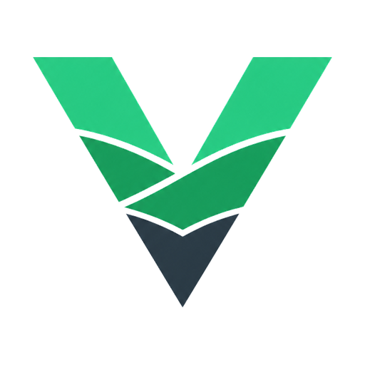

  

# Vueland

**Vueland** is a frontend platform for Vue 3, designed to help developers build modern, consistent, and scalable interfaces faster.

It combines a Vue component library, theming system, presets, composables, directives, and a custom JIT utility layer into a single foundation for application development.

Vueland is not just a UI kit. It is a platform-oriented toolkit for teams that want clean architecture, flexible customization, and a consistent design language across projects.

## Why Vueland?

Modern frontend development often requires combining multiple tools: component libraries, utility CSS systems, theme managers, helper utilities, and documentation workflows.

Vueland brings these ideas together in one ecosystem built specifically for Vue 3.

The goal of the platform is to provide a practical foundation for product teams, design systems, dashboards, SaaS applications, internal tools, and long-term frontend projects.

## Core ideas

- **Vue 3 first** — built around the modern Vue ecosystem.
- **Component-driven** — reusable, customizable, and consistent UI components.
- **Theme-ready** — a foundation for design tokens, presets, and visual customization.
- **Utility-powered** — includes a JIT utility layer for arbitrary utility classes.
- **Developer-focused** — created with DX, clarity, and extensibility in mind.
- **Platform mindset** — components, utilities, composables, directives, themes, presets in one ecosystem.

## Packages

Vueland currently includes:

### `@vueland/ui`

A Vue 3 component library focused on clean APIs, flexible styling, and consistent UI patterns.

### `@vueland/utils-jit`

A Vite JIT plugin for generating arbitrary utility classes on demand.

## Project status

Vueland is currently in active early development.

The API, package structure, and design system may evolve as the platform grows. The project is being shaped around real-world frontend needs, with a focus on scalability, maintainability, and developer experience.

## Vision

The long-term vision of Vueland is to become a complete frontend foundation for Vue 3 projects.

Vueland aims to bring together:

- UI components
- Theme system
- Design presets
- Utility classes
- Composables
- Directives
- Developer-first workflows

The goal is to give Vue developers a solid base for building polished applications without losing flexibility or control.

---

# Vueland

**Vueland** — это frontend-платформа для Vue 3, созданная для быстрой разработки современных, единообразных и масштабируемых интерфейсов.

Платформа объединяет библиотеку Vue-компонентов, систему темизации, пресеты, composables, директивы и собственный JIT-слой utility-классов в единую основу для разработки приложений.

Vueland — это не просто UI kit. Это платформенный набор инструментов для команд и разработчиков, которым важны чистая архитектура, гибкая кастомизация и единый визуальный язык в разных проектах.

## Почему Vueland?

В современной frontend-разработке часто приходится объединять множество отдельных инструментов: библиотеки компонентов, utility CSS, системы темизации, вспомогательные утилиты и документацию.

Vueland собирает эти идеи в одну экосистему, созданную специально для Vue 3.

Цель платформы — дать практичную основу для продуктовых команд, дизайн-систем, админ-панелей, SaaS-приложений, внутренних инструментов и долгосрочных frontend-проектов.

## Основные идеи

- **Vue 3 first** — платформа строится вокруг современного Vue-стека.
- **Компонентный подход** — переиспользуемые, кастомизируемые и согласованные UI-компоненты.
- **Готовность к темизации** — основа для design tokens, пресетов и визуальной настройки.
- **Utility-powered** — собственный JIT-слой для генерации arbitrary utility-классов.
- **Фокус на разработчиках** — внимание к DX, понятности и расширяемости.
- **Платформенный подход** — компоненты, утилиты, composables, директивы, темы, пресеты, документация и playground в одной экосистеме.

## Пакеты

На текущем этапе Vueland включает:

### `@vueland/ui`

Библиотеку компонентов для Vue 3 с фокусом на понятные API, гибкую стилизацию и единые UI-паттерны.

### `@vueland/utils-jit`

Vite JIT plugin для генерации arbitrary utility-классов по мере необходимости.

### `docs`

Документацию на базе VitePress.

### `playground`

Песочницу для разработки и тестирования компонентов, утилит, тем и возможностей платформы.

## Статус проекта

Vueland находится на активной ранней стадии разработки.

API, структура пакетов и дизайн-система могут меняться по мере развития платформы. Проект формируется вокруг реальных потребностей frontend-разработки с акцентом на масштабируемость, поддерживаемость и developer experience.

## Видение

Долгосрочная цель Vueland — стать полноценной frontend-основой для Vue 3 проектов.

Vueland стремится объединить:

- UI-компоненты
- Систему темизации
- Design presets
- Utility-классы
- Composables
- Директивы
- Удобные workflows для разработчиков

Цель платформы — дать Vue-разработчикам прочную базу для создания качественных приложений без потери гибкости и контроля.
